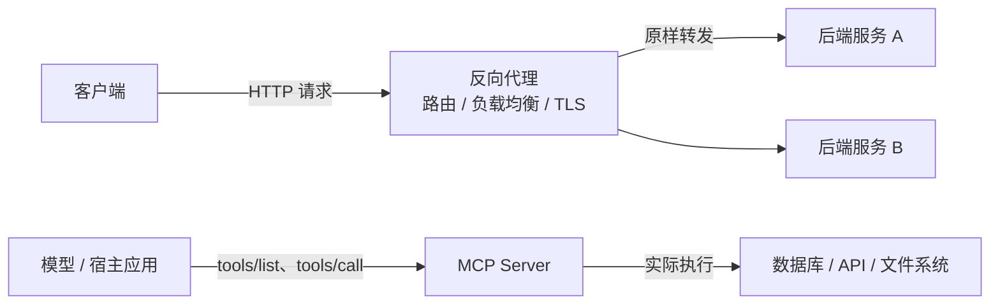

### **反向代理转发的是"网络请求"，MCP 暴露的是"可调用的能力"——前者工作在路由与传输层，透明搬运流量、不关心内容语义；后者工作在语义层，把外部系统包装成带 schema 的工具，让模型自己发现并选择调用。**

### **两者为什么会让人觉得像**

它们有一个共同的表象：都"夹在中间"。反向代理夹在客户端和后端服务之间，MCP Server 夹在模型和某个外部系统（数据库、API、文件系统）之间。位置相似，但做的事情完全不同——一个负责把流量原样搬过去，另一个负责把别人已有的功能包装成模型能理解的接口。

### **反向代理：网络层的"传话人"**

反向代理是站在服务端一侧的代理。客户端只认识代理暴露出来的域名和端口，以为自己就是在跟目标服务器说话；代理收到请求后，按配置规则（路径、域名、请求头等）决定转发给哪台后端，再把响应原样回传。

它的核心特征是"透明"：代理本身不解析请求的内容，也不关心你请求的是"查询用户"还是"上传文件"，只负责搬运。正因如此，它顺手承担的通常是这些基础职责——TLS/HTTPS 终止（证书统一在代理层管理）、负载均衡（把流量分给多台后端）、缓存与压缩、静态资源直出、统一入口与路由分发、隐藏后端拓扑、限流与访问控制。常见实现有 Nginx、Caddy、HAProxy、Traefik，云厂商的 SLB/CLB 本质上也是同一类东西。

### **MCP：语义层的"能力接口"**

MCP（Model Context Protocol）解决的是另一个问题：怎么让 AI 应用用一套统一标准接上外部的工具和数据源。

它的角色分工是：宿主应用里跑 MCP Client，连到一个 MCP Server，Server 再对接真正的外部系统。MCP Server 会把自己的能力声明成一个个带类型定义的工具（tool）——包含工具名、用途描述、参数 schema。模型拿到这份清单后，自己判断该调哪个、传什么参数，然后发出结构化调用，Server 执行完把结果返回。

所以 MCP 的关键词是"发现"与"调用"，而不是"转发"：它交换的是 JSON-RPC 这类结构化消息，内容有语义；动作由模型依据工具描述自主决定，而不是客户端事先把地址指定死。除工具外，MCP 还定义了资源（可读取的数据）和提示模板等概念，传输上通常分本地 stdio 和基于 HTTP 的远程两种方式。

### **放到一起对比**

| 维度 | 反向代理 | MCP |
| --- | --- | --- |
| 所在层次 | 路由 / 传输层 | 语义 / 能力层 |
| 交换的内容 | 原样的 HTTP 请求与响应 | 结构化的工具调用（JSON-RPC） |
| 是否理解内容 | 不理解，透明搬运 | 理解，有工具 schema 与语义 |
| 谁决定动作 | 客户端明确指定目标 | 模型根据工具描述自己挑 |
| 核心职责 | 路由、负载均衡、TLS、缓存、限流 | 让模型接上数据源与操作能力 |
| 典型实现 | Nginx、Caddy、HAProxy、SLB | MCP Client / Server 及各类 SDK |

一个好用的类比：反向代理像公司的总机或前台，把来电转到对应部门，但它不参与通话内容；MCP 更像 USB 或"模型的插件系统"——不关心背后插的是数据库还是某个 API，插上就能被模型发现并使用。

### **会重叠、但别混淆的地方**

两者确实有交集。你完全可以写一个 MCP Server 去包一层已有的 REST API，让模型通过工具调用的方式使用它；也存在所谓"MCP 网关"，把多个 MCP Server 聚合成统一入口——这时候它的某个实现看起来有点像代理。但即便长得像，MCP 协议做的事依然是能力发现和调用编排，而不是流量转发。

反过来，两者还能组合使用：在一个 MCP Server 前面放一层反向代理，负责 HTTPS、鉴权和统一入口，是相当常见的部署方式。两者并不互斥，只是各自解决不同层面的问题。
